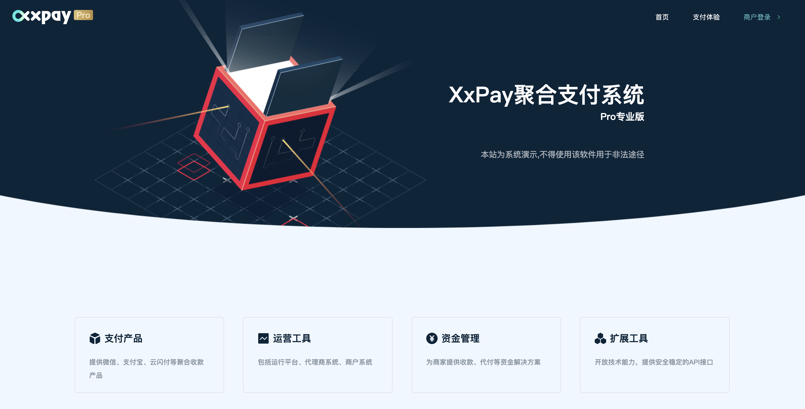
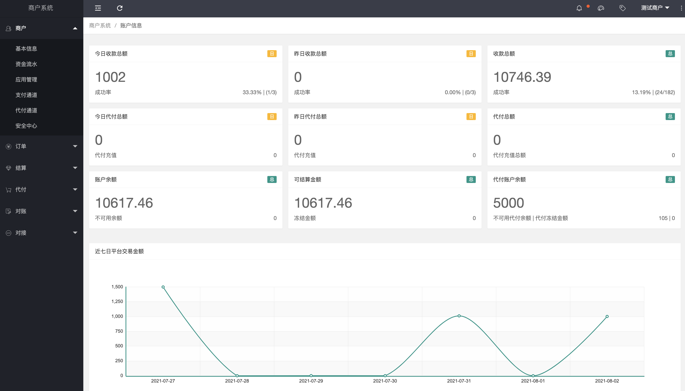
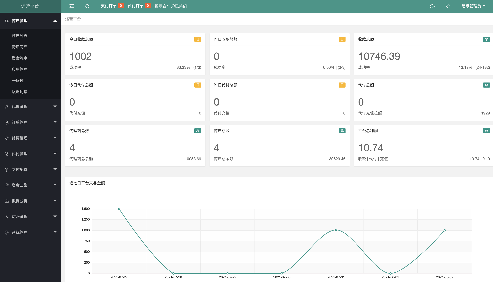
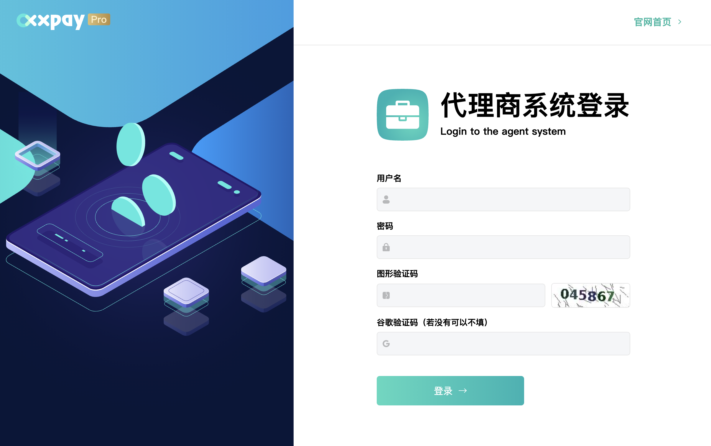
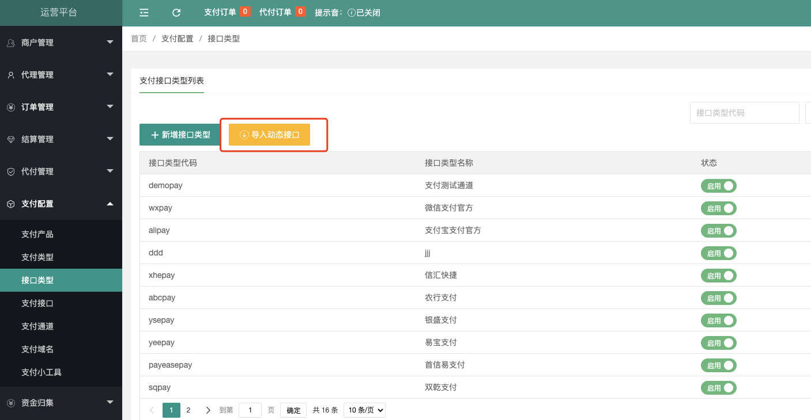
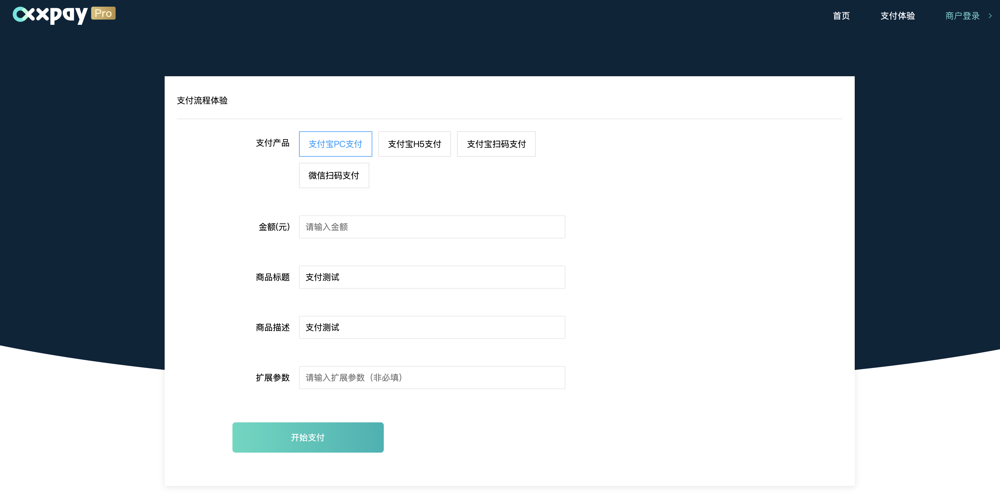
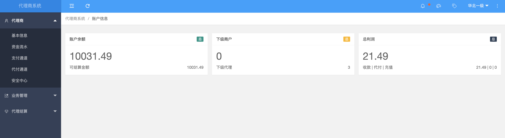
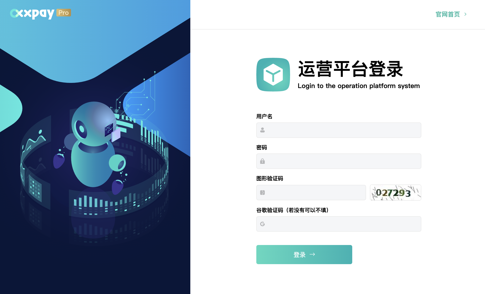
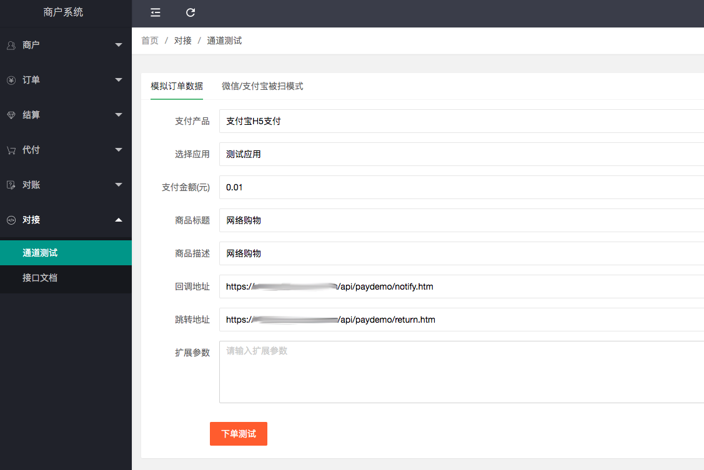
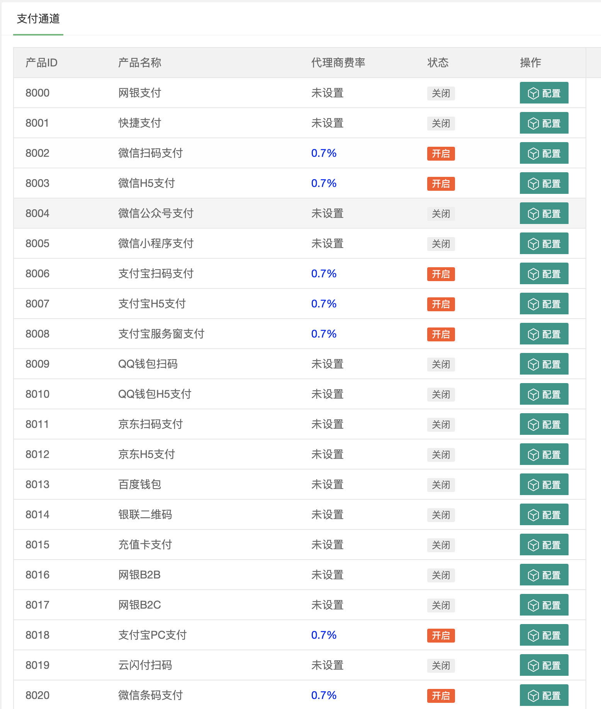

    

# 👏👏👏xxpaypro👏👏👏
3.5版 3.6版 开源 源代码 可以看我的说明和图，另外github上门的几个都是骗子

[官网](http://www.aprxapp.cn/) |
[在线体验](http://di.aprxapp.cn/) |
[帮助文档](http://www.aprxapp.cn/zt/homeservicev6/index.html) |
[技术社区](http://www.aprxapp.cn/zt/homeservice/baojia.html)

[comment]: <> ([宽屏预览]&#40;https://gitee.com/ZhongBangKeJi/crmeb_java/blob/master/README.md&#41;)

    如果对您有帮助，您可以点右上角 "Star" ❤️ 支持一下 谢谢！

---

### 📖 简介：

xxpay4pro为xxpay pro版，使用spring boot + dubbo架构开发。包括运营平台、代理商系统、商户系统、支付系统，结算系统、对账系统等。

---

### 💻 运行环境及框架：
~~~
模块说明
xxpay-service 所有核心业务方法封装，供其他模块引用后调用

xxpay-core 核心包，包括dubbo服务接口以及实体bean,以及公用引用及常用工具类等

xxpay-manage 运营平台（接口和管理界面，前后端分离）

xxpay-merchant 商户系统（接口和管理界面，前后端分离）

xxpay-agent 代理商系统（接口和管理界面，前后端分离）

xxpay-pay 支付网关，提供商户访问的支付接口及对接所有支付通道实现

xxpay-task定时任务，包括对账服务、结算服务，部署时需单节点部署

xxpay-z-api-base 支付接口的基础包
~~~

---

唯一联系TG：@jeequan https://t.me/jeequan  
更多系统点击这里 http://www.aprxapp.cn/ 

---

### 💟 UI界面
#### 核心功能
s

### 📱 预览

### WEB PC管理端预览

---
### 📲 江湖科技
成功运营经验，加密支付通道，确保资金安全，一站式保姆维护服务，让您轻松月入百万。

唯一联系TG：@jeequan https://t.me/jeequan  
更多系统点击这里 http://www.aprxapp.cn/ 

---

